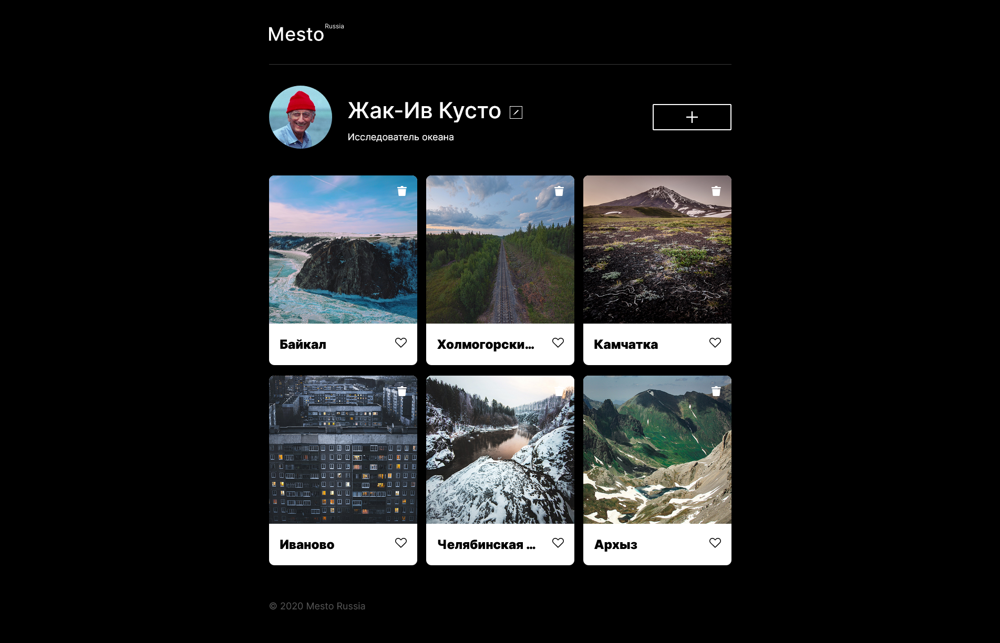
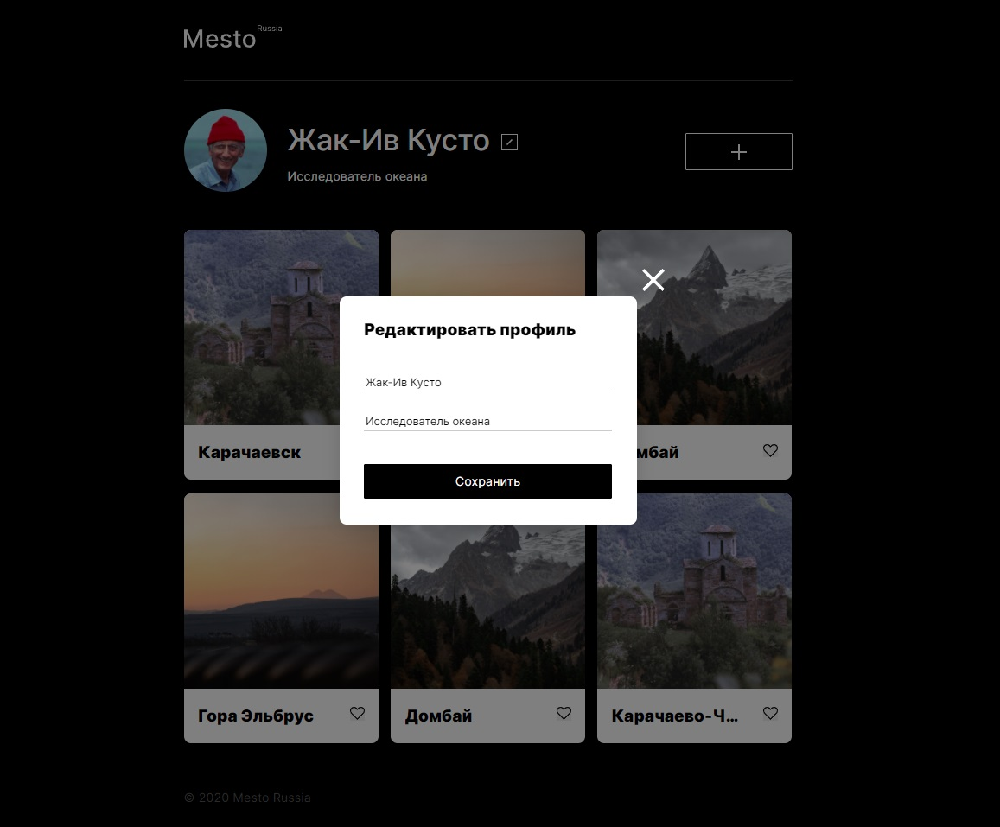

Проект "Место"

Сайт является адаптивным и корректно отобржается на большинстве современных разрешений.
В нем использованы современные методы верстки с помощь "Grid" и "Flexbox"

На сайте присутствуют всплывающие окно "popup" позволяющее менять заголовок, текст под заголовком, добавлять новые карточки, открывать картинки на полный экран.
Окна popup умеют проверять (валидировать) введенные значение.
Внутри карточек присутствуют элементы "like" и "Delete". позволяющие оценивать изображение, и удалять карточку целиком.

Управление элементами осуществялется при помощи java script.

 
Сайт доступен по ссылке https://olgerd999.github.io/mesto/

 

 

Картинки оптимизированы для ускорения работы на устройствах с медленным интернетом.

Автор проекта Хвостов Олег Игоревич.