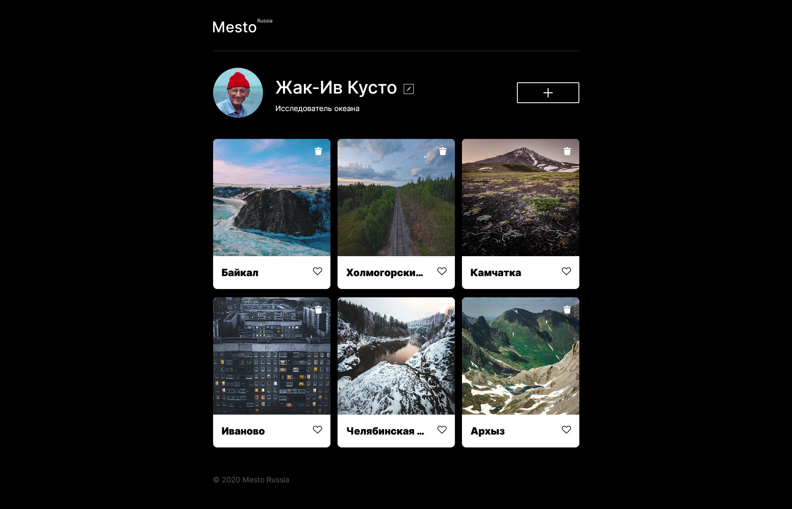

Проект "Место"

Сайт является адаптивным и корректно отобржается на большинстве современных разрешений.
В нем использованы современные методы верстки с помощь "Grid" и "Flexbox"

Сайт настроен под сборку вебпаком
Используется ООП с разбиением проекта на модули
Код разбит на классы
Сайт делает fetch запросы

Управление элементами осуществялется при помощи java script.

 
Сайт доступен по ссылке https://olgerd999.github.io/mesto/

 

 

Картинки оптимизированы для ускорения работы на устройствах с медленным интернетом.

Автор проекта Хвостов Олег Игоревич.